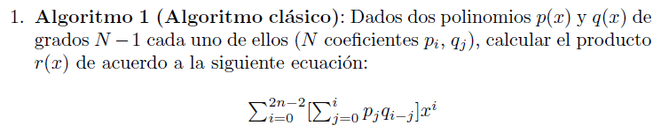

***
>**Autora:**         *María D. Batista Galván*  
>**Fecha:**          *Lunes 24 de Febrero de 2014*  
>**Asignatura:**     *DISEÑO Y ANÁLISIS DE ALGORITMOS*  
>**Práctica:**       **Práctica 3: Producto de Polinomios** 
***

##Objetivos

>Se trata de realizar un estudio computacional de algoritmos que realizan
el producto de polinomios. El estudio debería realizarse para problemas de diferente
tamaño de forma que quede reflejado en ellos el comportamiento del
algoritmo. El estudio debe describir la arquitectura sobre la que se desarrolla la
experimentacióon y presentar una tabla y una gráfica en los que se muestren los
resultados obtenidos.

##Especificaciones

>Se generarán aleatoriamente los polinomios sobre los que se realiza el estudio.
El estudio comparativo debe realizarse con el **algoritmo clásico**.

###Especificaciones:###

>Considérese la siguiente jerarquía de clases para elaborar el producto de
polinomios. Debe añadirse a la clase Monomio los operadores que se consideren
necesarios.

